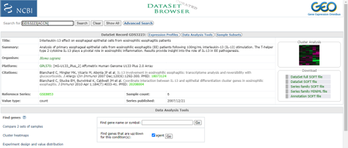

```{r class.source = 'fold-hide', setup, include=FALSE}
library(knitr)
library(kableExtra)
library(rmdformats)

## Global options
options(max.print="75")
opts_chunk$set(echo=TRUE,
	             cache=FALSE,
               prompt=FALSE,
               tidy=TRUE,
               comment=NA,
               message=FALSE,
               warning=FALSE)
opts_knit$set(width=75)
```

# Introducción

En la presente PEC vamos a realizar el análisis de microarrays correspondiente al estudio realizado sobre pacientes que padeden esofagitis eosinofílica (EE). Para ello se realiza un análisis de microarrays 3 muestras de biopsias de pacientes con EE, se cultivan y se estimulan con 100 ng. IL-13 durante 48 horas. Estas muestras estimuladas se comparan frente a muestras control, que no han sido sometidas al tratamiento con IL-13. Estas muestras se encuentran en [GEO](<https://www.ncbi.nlm.nih.gov/geo/>), con el identificador de acceso [GDS3223](<https://www.ncbi.nlm.nih.gov/sites/GDSbrowser?acc=GDS3223>). 
 

El objetivo del estudio es la detección de genes que se encuentren sobreexpresados o downregulated en las muestras tratadas con IL-13 ya que basándose en los artículos 
[@blanchard200713] y [@blanchard2010coordinate], la patogénesis de la EE está mediada por la respuesta inducida por la IL-13 en las células epiteliales. 

# Material y métodos:


